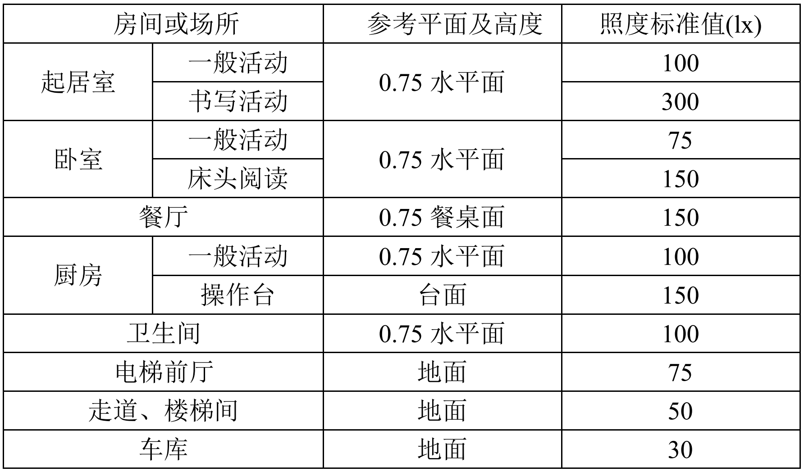

.. OpenAIE documentation master file, created by
   sphinx-quickstart on Wed Apr 29 10:16:47 2020.
   You can adapt this file completely to your liking, but it should at least
   contain the root `toctree` directive.

OpenAIE 启蒙 使用说明文档
####################################################

    启蒙是OpenAIE系列模块

    
    
 

简介
****************************************************** 

* 供电方式：USB TypeC（DC: 5V）
* 处理器: K210，RISC-V 64 位双核 CPU，主频：400MHz；具备卷积人工神经网络硬件加速器 KPU，可高性能进行卷积人工神经网络运算。
* 存储：Flash：16MiB; SRAM：8MiB; 支持SD卡拓展
* 图像传感器：200万像素彩色摄像头 
* 显示屏：2.0英寸，分辨率240*320，IPS全视角彩色显示屏
* 板载功能：
    + 1. 三颗可编程全彩LED
    + 2. 两颗白光LED
    + 3. 两个按键
    + 4. 无源蜂鸣器
    + 5. 三轴陀螺仪，三轴加速度计
    + 6. 光照强度传感器
    + 7. 非特定人语音识别模块
+ 拓展接口：Grove(UART/I2C/GPIO) 

 
------------------------------------------------------

入门使用
******************************************************

点击下载
\ `相关资料 <https://pan.baidu.com/s/1aj5JFqdzW-t58mJ5YncZFw>`_ 
提取码：3qo0 。

1. 驱动安装
======================================================
开发板通过 UART 串口转 USB 连接电脑通信，因此需安装驱动 USB 转 UART 串口驱动。

进入资料下载链接，选择下载驱动（x64对应Windows 64位，x86对应Windows 32位）。打开exe文件安装。

安装驱动后，通过USB数据线连接开发板，将鼠标移动到我的电脑，右键属性-->设备管理器-->端口(COM和LPT)，可查看到设备连接信息，如下图所示：

2. 软件安装(IDE)
======================================================
下载IDE，根据提示安装即可。IDE安装成功后，打开软件，按下图所示操作，运行第一个程序。

   
3. 案例测试
======================================================
如下图所示，输入或复制示例程序到程序编辑框内，点击“运行”，观察。

4. 固件升级
======================================================
下载固件升级工具，解压进入文件夹，找到并打开"kflash_gui.exe"。按下图所示操作，烧录固件。

.. figure:: 固件烧录.png  
   :width: 350px
   :align: center

------------------------------------------------------

板载功能使用教程 
******************************************************

1. RGB LED
======================================================

板载三颗RGB全彩LED，每种颜色可实现0~255共256级亮度调节，通过对红(Red)、绿(Green)、蓝(Blue)三个颜色通道的调节可叠加发出多种颜色的光。

::

设置 RGB LED 参数
::

    ''' 
     id -- 板载灯编号，由左至右为：0，1，2；
     r, g, b -- 颜色亮度值，取值范围：0~255 
    '''
    rgb.set(id, (r, g, b)) 
    
    # 或：
    color = (r, g, b)  # tuple类型 
    rgb.set(id, color)  

将设置值输出显示
::

    rgb.display()  

.. Note:: 每种颜色的LED共有2^8=256(0~255)个发光等级，即共有2^8^3=16 777 216种颜色组合。通过查找 \ `RGB颜色对照表 <https://tool.oschina.net/commons?type=3>`_ 生成自己喜欢的颜色。

示例1：点亮LED
::

    from openaie import rgb     # 导入模块
    
    rgb.set(0, (5, 0, 0))       # 将第1个灯设置为红色亮度值为：5
    rgb.set(1, (0, 10, 0))      # 将第2个灯设置为蓝色亮度值为：10
    rgb.set(2, (0, 0, 20))      # 将第3个灯设置为绿色亮度值为：100
    rgb.display()               # 输出显示

示例2：颜色渐变

RGB彩虹色渐变算法: https://www.cnblogs.com/wzdxy/p/5346930.html
::

    import time
    from openaie import rgb   
    
    def wheel(pos):
        # 通过改变在0和255之间的每个颜色参数产生彩虹色光谱
        # Input a value 0 to 255 to get a color value.
        # The colours are a transition r - g - b - back to r.
        if pos < 0 or pos > 255:
            r = g = b = 0
        elif pos < 85:
            r = int(pos * 3)
            g = int(255 - pos*3)
            b = 0
        elif pos < 170:
            pos -= 85
            r = int(255 - pos*3)
            g = 0
            b = int(pos*3)
        else:
            pos -= 170
            r = 0
            g = int(pos*3)
            b = int(255 - pos*3)
        return (r, g, b)

    def rainbow_cycle(wait_ms):
        # 彩虹效果
        n=3
        for j in range(255):
            for i in range(n):
                pixel_index = (i * 256 // n) + j
                rgb.set(i, wheel(pixel_index & 255)) 
            rgb.display()
            time.sleep_ms(wait_ms)
     
    while True:
        rainbow_cycle(10)    
        
2. 白光 LED
======================================================
后置两颗白光LED，可用于摄像头的背光灯等。可通过编程控制亮度。

.. Note:: 不能单独控制

设置灯亮度
::

    '''
     brightness -- 亮度，取值范围: 0~100
    '''
    lamp.set(brightness) 
    
示例1：呼吸灯
::

    from openaie import lamp
    import time

    dir = True
    while True:
        for i in range(80):
            if dir :
                lamp.set(i)
            else :
                lamp.set(100 - i)
            time.sleep(0.05)
        dir = not dir

3. 蜂鸣器
======================================================
无源蜂鸣器，可通过不同频率的信号驱动，发出不同音调的声音。

蜂鸣器鸣响
::

    ''' 
     freq -- 频率
     time_ms -- 时间，单位为：毫秒
    ''' 
    buzzer.tone(freq, time_ms) 

关停蜂鸣器
::

    buzzer.no_tone()    

示例1：依次发出 Do、Re、Mi、Fa、Sol、La、Si
::

    import time
    from openaie import buzzer
    
    tone_list = (289, 661, 700, 786, 882, 990, 1112)
    for i in range(7):    
        buzzer.tone(tone_list[i])
        time.sleep_ms(500)
    buzzer.no_tone()

 
4. 按键
======================================================
左右两个按键，按下接低电平，弹起接高电平。

获取按键状态
::

    '''
     返回布尔值：
         按键按下 -- True 
         按键弹起 -- False
    ''' 
    button_left.is_press() 
    button_right.is_press() 

示例1：按键控制开关灯 
::

    import time
    from openaie import*
    
    while (True):
        if button_left.is_press(): # 检测到按键按下
            utime.sleep_ms(10)
            if button_left.is_press():
                print("left button press")
                lamp.set(20)
            while (button_left.is_press()) : # 等待按键释放
                pass
        if button_right.is_press(): # 检测到按键按下
            utime.sleep_ms(10)
            if button_right.is_press():
                print("right button press")
                lamp.set(0)
            while (button_right.is_press()) : # 等待按键释放
                pass  

 

5. 光照强度传感器
======================================================
\ `光照强度 <https://www.cnblogs.com/zlbg/p/4049962.html>`_ 
        
光照强度传感器可检测光照强度，测量范围：1~65535lx(勒克斯)

读取光照强度
::

    '''
     返回光照强度，单位：lx(勒克斯)
    ''' 
    light.read() 
 
示例1：光控灯
::

    import time
    from openaie import light, lamp
    while True:
        brightness = light.read()
        print("brightness: %d lx"%brightness)
        if brightness < 50:  # 当亮度小于一定值时，打开灯
            lamp.set(20)
        else :
            lamp.set(0)
        time.sleep_ms(100)

示例2：根据环境光强度调节显示屏亮度
::

    import time, lcd
    from openaie import *

    lcd.init(freq=15000000, color=lcd.WHITE)
    lcd.direction(lcd.YX_LRUD)
    lcd.draw_string(105, 110, "hello enlighten", lcd.BLUE, lcd.WHITE)
    while True:
        brightness = light.read()
        print(brightness)
        if brightness < 200:
            lamp.set_backlight(brightness*0.45 + 5)
        else:
            lamp.set_backlight(90)
        time.sleep_ms(50)
    
住宅建筑照明标准值

6. 姿态传感器
======================================================

惯性测量单元含三轴加速度计和三轴陀螺仪。

.. ref:: 飞行器姿态角：https://blog.csdn.net/u012763833/article/details/52396133

编程方法：
::

    ''' 
     读加速度，单位：m/s^2
     axis -- 'x', 'y', 'z'
    ''' 
    imu.read_accel(axis)     

    '''
     读角速度，单位：°/S
     axis -- 'x', 'y', 'z'
    '''
    imu.read_gryo(axis) 

    '''
     读姿态角(roll - 横滚角，pitch - 俯仰角，yaw - 偏航角)
     sel -- 'roll', 'pitch', 'yaw' 
    '''
    # TODO...
    # imu.read_attitude(sel)

示例1：数据读取显示
::

    import time, lcd, image
    from openaie import imu

    lcd.init(freq=15000000, color=(0,0,0))
    lcd.direction(lcd.YX_LRUD)
     
    img = image.Image()
    while True:
        img.clear()
        accel_x = imu.read_accel('x')
        accel_y = imu.read_accel('y')
        accel_z = imu.read_accel('z')
        gyro_x = imu.read_gyro('x')
        gyro_y = imu.read_gyro('y')
        gyro_z = imu.read_gyro('z')
        img.draw_arrow(160, 160, 230, 160, color=(200,0,0), thickness=2)
        img.draw_arrow(160, 160, 160, 90, color=(0,200,0), thickness=2)
        img.draw_arrow(160, 160, 110, 210, color=(0,0,200), thickness=2)
        img.draw_string(10, 10, ("accel x: %.1f m/s^2" % accel_x), color=(200,0,0), scale=1.5)
        img.draw_string(10, 30, ("accel y: %.1f m/s^2" % accel_y), color=(0,200,0), scale=1.5)
        img.draw_string(10, 50, ("accel z: %.1f m/s^2" % accel_z), color=(0,0,200), scale=1.5)
        img.draw_string(170, 10, ("gyro x: %d" % gyro_x), color=(200,0,0), scale=1.5)
        img.draw_string(170, 30, ("gyro y: %d" % gyro_y), color=(0,200,0), scale=1.5)
        img.draw_string(170, 50, ("gyro z: %d" % gyro_z), color=(0,0,200), scale=1.5)
        lcd.display(img)
        time.sleep_ms(100) 

示例2：水平球
::

    import time, sensor, image, lcd, math     
    from openaie import *
     
    lcd.init(freq=15000000)
    lcd.direction(lcd.YX_LRUD)

    '''
     数值映射
     @param in_min, in_max 输入区间 
     @param out_min, out_max 输出区间
    '''
    def math_map(input, in_min, in_max, out_min, out_max): 
        output = (input-in_min)*(out_max-out_min)/(in_max-in_min) + out_min # 距离缩放 + 偏差
        return output

    img = image.Image()
    while True:
        accel_x = imu.read_accel('x')
        accel_y = imu.read_accel('y')
        cord_x = int(math_map(accel_x, (-9.8), 9.8, 100, -100))
        cord_y = int(math_map(accel_y, (-9.8), 9.8, -100, 100))
        img.clear()
        img.draw_circle(159, 119, 8, color=(0,0,255), thickness=2, fill=False)
        img.draw_circle(159, 119, 105, color=(0,0,255), thickness=2, fill=False)
        img.draw_circle(cord_x+159, cord_y+119, 7, color=(255,0,0), thickness=1, fill=True)
        dis = '(%.1f, %.1f)'%(accel_x, accel_y) 
        img.draw_string(20, 20, dis, lcd.BLUE)
        lcd.display(img)
        if (math.fabs(accel_x) < 0.2) and (math.fabs(accel_y) < 0.2):
            rgb.set(1, (0,10,0))
        else:
            rgb.set(1, (0,0,0))
        rgb.display()  
        time.sleep_ms(50)
        
示例3：相机水平参考线
::

    import sensor, lcd, math, time
    from openaie import*

    lcd.init(freq=15000000)
    lcd.direction(lcd.YX_LRUD)
    sensor.reset()                     
    sensor.set_hmirror(False)
    sensor.set_vflip(False)             
    sensor.set_pixformat(sensor.RGB565)
    sensor.set_framesize(sensor.QVGA)
    sensor.run(1)
     
    def trans(angle):
        cord_x_center = 160
        cord_y_center = 120
        radius = 65
        rad = angle #angle*math.pi / 180 # 转为弧度
        if angle>0:
            x0 = int(cord_x_center - radius*math.cos(rad))  
            y0 = int(cord_y_center - radius*math.sin(rad))  
            x1 = int(cord_x_center + radius*math.cos(rad))  
            y1 = int(cord_y_center + radius*math.sin(rad))  
            img.draw_line(x0, y0, x1, y1, color=(255,0,0), thickness=3)
        else:
            img.draw_line(95, 120, 225, 120, color=(0,255,0), thickness=3) 

    while True:
        img = sensor.snapshot()
        img.draw_line(50, 120, 90, 120, color=(0,255,0), thickness=3)
        img.draw_line(230, 120, 270, 120, color=(0,255,0), thickness=3)
        accel_x = imu.read_accel('x')
        accel_y = imu.read_accel('y')

        #angle_a = math.acos(accel_y/9.8)*180/math.pi # 转为角度
        angle_rad = math.acos(accel_y/9.8)
        angle = int(angle_rad*180/math.pi)
        if accel_x < 0:
            angle_rad = math.pi-angle_rad
        trans(angle_rad)   
        
        print(angle)
        img.draw_string(12, 10, str(angle), color=(0,0,255), scale=2)
        lcd.display(img) 
    
  
7. 语音识别
======================================================
非特定人语音识别

添加识别关键词
::
    
    '''
     str：识别语句的拼音
     ret: 识别到关键词时的返回值
    '''
    asr.add_cmd(str, ret)
    
开始运行
::    

    asr.run()    
    
读取识别结果 
::    
        
    asr.read()    

.. Note:: 安静的环境中可获得较大的识别准确率

示例1：语音控制开关灯
::

    from openaie import *
    import time
    asr.add_cmd("hong", 1)       # 添加关键词“红”，返回值为：1
    asr.add_cmd("lv", 2)         # 添加关键词“绿”，返回值为：2
    asr.add_cmd("lan", 3)        # 添加关键词“蓝”，返回值为：3
    asr.add_cmd("kai deng", 4)   # 添加关键词“开灯”，返回值为：4
    asr.add_cmd("guan deng", 5)  # 添加关键词“关灯”，返回值为：5
    asr.run()

    def asr_test(sel):
        if sel == 1 :
            print("red")
            rgb.set(0, (20, 0, 0))
            rgb.display()
        elif sel == 2 :
            print("green")
            rgb.set(0, (0, 20, 0))
            rgb.display()
        elif sel == 3 :
            print("blue")
            rgb.set(0, (0, 0, 20))
            rgb.display()
        elif sel == 4 :
            print("turn on the light")
            lamp.set(10)
        elif sel == 5 :
            print("turn off the light")
            lamp.set(0)
            rgb.set(0, (0, 0, 0))
            rgb.display()

    while True:
        asr_test(asr.read_res())  
        time.sleep_ms(100)    

示例2：增加语音唤醒设置
::

    import time, random
    from openaie import *
                     
    asr_run = False 
    res_str = ('我在', '你说......', '诶！', '来啦', '嗨!')

    asr.add_cmd("hong", 1)                  # 添加关键词“红”，返回值为：1
    asr.add_cmd("lv", 2)                    # 添加关键词“绿”，返回值为：2
    asr.add_cmd("lan", 3)                   # 添加关键词“蓝”，返回值为：3
    asr.add_cmd("kai deng", 4)              # 添加关键词“开灯”，返回值为：4    
    asr.add_cmd("guan deng", 5)             # 添加关键词“关灯”，返回值为：5
    asr.add_cmd("xiao ming tong xue", 66)   # 唤醒词
    asr.add_cmd("tui xia", 65)              # 退出
    asr.run()

    def asr_test(sel):
        global asr_run
        if sel == 66:
            asr_run = True
            rgb.set(1, (0, 20, 0))
            rgb.display()
            print(res_str[random.randint(0, 4)])
        elif sel == 65:
            asr_run = False 
            rgb.set(1, (0, 0, 0))
            rgb.display()
            print("=========== END ===========")
        if asr_run == True:
            if sel == 1 :
                print("red")
                rgb.set(0, (20, 0, 0))
                rgb.display()
            elif sel == 2 :
                print("green")
                rgb.set(0, (0, 20, 0))
                rgb.display()
            elif sel == 3 :
                print("blue")
                rgb.set(0, (0, 0, 20))
                rgb.display()
            elif sel == 4 :
                print("turn on the light")
                lamp.set(10)
            elif sel == 5 :
                print("turn off the light")
                lamp.set(0)
                rgb.set(0, (0, 0, 0))
                rgb.display()

    while True:
        asr_test(asr.read_res())  
        time.sleep_ms(100)    
    
8. 液晶显示屏
====================================================== 
显示原理
参数
IPS全视角
分辨率：240*320(QVGA)

编程方法：
::

    '''
     初始化
    ''' 
    lcd.init(freq=15000000, color=lcd.BLACK)
    
    '''
     设置背光亮度
     brightness:0~100
    '''
    lcd.set_backlight(brightness)
    
    '''
     显示字符 
    '''
    lcd.draw_string(80, 100, "hello enlighten", lcd.RED, lcd.BLACK)
    
    '''
     显示图片
    '''
    lcd.display(image, roi=Auto)
    
    ''' 
     清空显示
    ''' 
    lcd.clear()
    
    '''
     设置显示方向 0 1 2 3
    '''
    lcd.rotation()
    
    '''
     是否镜像显示 
     invert -- True or False
    ''' 
    lcd.mirror(invert)

示例1：字符串，图片显示
::

    # TODO...
    # from openaie import *

9. 摄像头
======================================================   
原理

传感器参数：200万像素(OV2640)

编程方法：
::

    '''
     重置并初始化摄像头
    '''
    sensor.reset()

    '''
     启动或关闭捕获图像功能
     enable -- True or False
    ''' 
    sensor.run(enable)

    '''
     设置帧大小 
     framesize -- sensor.QVGA, sensor.QQVGA
    ''' 
    sensor.set_framesize(framesize)

    '''
     设置帧格式 
     format -- sensor.RGB565, sensor.GRAYSCALE
    ''' 
    sensor.set_pixformat(format)

    ''' 
     拍照
    ''' 
    sensor.snapshot()

    '''
     跳帧
    '''
    sensor.skip_frames([n,time])

    '''
     设置对比度
    ''' 
    sensor.set_contrast(contrast)

    '''
     设置亮度
    '''
    sensor.set_brightness(brightness)

    ''' 
     设置饱和度
    '''
    sensor.set_saturation(saturation)

    '''
     自动增益 
     enable -- True or False
    '''
    sensor.set_auto_gain(enable, gain_db)

    '''
     设置水平镜像
     enable -- True or False
    '''
    sensor.set_hmirror(enable)

    '''
     设置垂直反转
     enable -- True or False
    '''
    sensor.set_vflip(enable)
    
示例1：视频拍摄显示
::

    import sensor,lcd

    lcd.init(freq=15000000)
    lcd.direction(lcd.YX_LRUD)
    sensor.reset()
    sensor.set_hmirror(False)
    sensor.set_vflip(False)
    sensor.set_pixformat(sensor.RGB565)
    sensor.set_framesize(sensor.QVGA)
    sensor.run(1)
    sensor.skip_frames(30)

    while True:
        img = sensor.snapshot()
        lcd.display(img)
     

综合测试程序
======================================================

::

    import utime
    from openaie import*
    import sensor, image, time, lcd

    lcd.init(freq=15000000)
    lcd.direction(lcd.YX_LRUD)
    sensor.reset()                      # Reset and initialize the sensor. It will
    sensor.set_hmirror(False)
    sensor.set_vflip(False)             # run automatically, call sensor.run(0) to stop
    sensor.set_pixformat(sensor.RGB565) # Set pixel format to RGB565 (or GRAYSCALE)
    sensor.set_framesize(sensor.QVGA)   # Set frame size to QVGA (320x240)
    sensor.skip_frames(time = 100)      # Wait for settings take effect.
    clock = time.clock()                # Create a clock object to track the FPS.

    while(True):
        clock.tick()                    # Update the FPS clock.
        img = sensor.snapshot()         # Take a picture and return the image.
        lcd.display(img)                # Display on LCD
        print(clock.fps())              # Note: MaixPy's Cam runs about half as fast when connected
        if button_left.is_press():
            utime.sleep_ms(5)
            if button_left.is_press():        
                lamp.set(90)
            while (button_left.is_press()) :
                pass
        if button_right.is_press():
            utime.sleep_ms(5)
            if button_right.is_press():
                lamp.set(0)
            while (button_right.is_press()) :
                pass  

------------------------------------------------------ 

机器视觉
******************************************************

图像
======================================================

创建返回 image 对象    
::

    '''
      Creates a new image object from a file at path. Alternatively, you may pass a width, height, and either sensor.BINARY, sensor.GRAYSCALE, or sensor.RGB565 to create new blank image object (initialized to 0 - black).
    '''
    class image.Image(path[, copy_to_fb=False])

保存图像 
::    

    '''
     Saves a copy of the image to the filesystem at path.
    '''
    image.save(path[, roi[, quality=50]])

清空图像  
::

    '''
     image Sets all pixels in the image to zero (very fast).
    ''' 
    image.clear([mask])

示例1：打开显示图像
::
    # TODO...
    
绘图
======================================================
画字符串 
::

    '''
     x0, y0, x1, y1 -- 起点终点位置
     text -- 字符串，单个字符尺寸为：8*10像素
     color -- 颜色，color=(r_val, g_val, b_val)，r_val, g_val, b_val取值范围：0~255
     scale -- 字体缩放
    '''
    image.draw_string(x, y, text, color, scale=1)

画线 
::

    '''
     x0, y0, x1, y1 -- 起点终点位置
     color -- 颜色，color=(r_val, g_val, b_val)，r_val, g_val, b_val取值范围：0~255
     thickness -- 线宽
    '''
    image.draw_line(x0, y0, x1, y1, color, thickness=1)

画圆形 
::

    '''
     x, y -- 圆心位置
     color -- 颜色，color=(r_val, g_val, b_val)，r_val, g_val, b_val取值范围：0~255
     thickness -- 线宽
     fill -- 填充
    '''
    image.draw_circle(x, y, radius, color, thickness=1, fill=False)

画矩形 
::

    '''
     x, y -- 起点位置
     w, h -- 宽和高
     color -- 颜色，color=(r_val, g_val, b_val)，r_val, g_val, b_val取值范围：0~255
     thickness -- 线宽
     fill -- 填充
    '''
    image.draw_rectangle(x, y, w, h, color, thickness=1, fill=False)

画十字 
::

    '''
     x, y --  中心位置
     color -- 颜色，color=(r_val, g_val, b_val)，r_val, g_val, b_val取值范围：0~255
     size -- 大小
     thickness -- 线宽
    '''
    image.draw_cross(x, y, color, size=5, thickness=1)

画箭头 
::

    '''
     x0, y0, x1, y1 -- 起点终点位置
     color -- 颜色，color=(r_val, g_val, b_val)，r_val, g_val, b_val取值范围：0~255
     thickness -- 线宽
    '''
    image.draw_arrow(x0, y0, x1, y1, color, thickness=1)

示例1：基础绘图测试
::

    import lcd, image
    
    lcd.init(freq=15000000, color=0x0000)
    
    # 创建一个空白图像，在图像上绘图，显示
    img = image.Image()
    img.draw_string(10, 10, "Enlighten", color=(0,0,100), scale=1)
    img.draw_line(100, 200, 200, 200, color=(0,100,100), thickness=1)
    img.draw_rectangle(80, 70, 60, 60, color=(0,100,0), thickness=1, fill=False)
    img.draw_circle(220, 100, 30, color=(100,0,0), thickness=1, fill=False)
    img.draw_cross(80, 180, color=(100,0,0), size=10, thickness=1)
    img.draw_arrow(20, 150, 60, 200, color=(0,100,100), thickness=1)
    lcd.display(img)

颜色识别
======================================================

LAB颜色阈值

* L -- 亮度 
* A -- 从绿色到红色的分量
* B -- 从蓝色到黄色的分量

识别色块 
::

    '''
     识别色块, 返回 image.blob 对象 List
	 roi -- roi = [x0, y0, x1, y1] 左上角坐标(x0,y0)，右下角坐标(x1,y1)
     thresholds -- LAB颜色阈值 (l_min, l_max, a_min, a_max, b_min, b_max)
	 x_stride -- x方向上检测最小宽度像素值，小于此范围的blob不检测
	 y_stride -- y方向上检测最小宽度像素值，小于此范围的blob不检测
    '''
    image.find_blobs([thresholds])
    image.find_blobs(thresholds, roi=Auto, x_stride=2, y_stride=1, invert=False, area_threshold=10, pixels_threshold=10, merge=False, margin=0, threshold_cb=None, merge_cb=None)
	
	   
Blob对象方法(class image.blob)
::

    '''
     Returns a list of 4 (x,y) tuples of the 4 corners of the object. 
    '''
    blob.corners()
    
    '''
     返回矩形框参数
    '''
    blob.rect()     # tuple (x, y, w, h)
    blob.x()        # 矩形框起点坐标x
    blob.y()        # 矩形框起点坐标y
    blob.w()        # 矩形框的宽度
    blob.h()        # 矩形框的高度
    blob.cx()       # 矩形框中心点坐标x
    blob.cy()       # 矩形框中心点坐标y
    
    '''
     返回色块内像素点
    '''
    blob.pixels()   

**阈值设置**

方法一：IDE：工具-->机器视觉-->阈值编辑器，按需求选择图像来源。移动滑块至目标检测区域调节为白色，其他区域为黑色，复制“LAB阈值”，如下图所示：

方法二：在IDE右下方的“直方图”中选择“LAB颜色空间”，在图像缓冲区中的目标区域点按鼠标拖拽，根据直方图信息填写“LAB阈值”，如下图所示：

.. Note:: 可在配图区域鼠标右键，选择“在新标签页中打开图片”查看大图。

示例1：寻找最大的色块
::

    import sensor, lcd, image

    def find_max_blobs(blobs):
        max_size = 0
        for blob in blobs:
            if blob.pixels() > max_size:
                max_blob = blob
                max_size = blob.pixels()
        return max_blob

    # LAB颜色阈值
    lab_threshold_red = (0, 100, 32, 120, -127, 127)
    lab_threshold_green = (0, 100, -114, -41, 97, -77)
    lab_threshold_blue = (0, 100, -128, 127, -128, -31)

    lcd.init(freq=15000000, color=(0,0,0))
    lcd.direction(lcd.YX_LRUD)
    sensor.reset()
    sensor.set_pixformat(sensor.RGB565)
    sensor.set_framesize(sensor.QVGA)
    sensor.set_hmirror(False)
    sensor.set_vflip(False)
    sensor.run(1)

    while True:
        img = sensor.snapshot()
        res = img.find_blobs([lab_threshold_blue]) # 识别蓝色
        if res:
            max = find_max_blobs(res)
            img.draw_rectangle(max.rect(), color=(0,0,255), thickness=2, fill=False)
            img.draw_string((max.x() + 5), (max.y() + 5), "blue", color=(255,255,255), scale=1.3)
        lcd.display(img)

形状识别
======================================================
识别矩形
::

    '''
     识别矩形，返回 image.rect 对象 List
     threshold -- 识别阈值
    '''
    image.find_rects(roi=Auto, threshold=10000)

Rectangle对象方法(class image.rect) 
::   

    '''
     返回矩形四个角的位置 (x,y) tuples of the 4 corners of the object.
    '''
    rect.corners()

    '''
     返回矩形相关信息  
    '''
    rect.rect() # tuple (x, y, w, h)
    rect.x()    # 矩形框起点坐标x
    rect.y()    # 矩形框起点坐标y
    rect.w()    # 矩形框的宽度
    rect.h()    # 矩形框的高度

    '''
     Returns the rectangle’s magnitude.
    '''
    rect.magnitude()
    
示例1：识别矩形并作标注 
::

    import sensor, image, lcd

    lcd.init(freq=15000000)
    lcd.direction(lcd.YX_LRUD)
    sensor.reset()                      
    sensor.set_hmirror(False)
    sensor.set_vflip(False)              
    sensor.set_pixformat(sensor.RGB565)
    sensor.set_framesize(sensor.QQVGA)
    sensor.run(1)
     
    while(True):
        img = sensor.snapshot()
        for r in img.find_rects(threshold = 20000):                     # 识别矩形，阈值 20000
            img.draw_rectangle(r.rect(), color = (255, 0, 0))           # 画出矩形，颜色为红色
            for r_c in r.corners():                                     # 找出矩形的四个角
                img.draw_circle(r_c[0], r_c[1], 5, color = (0, 255, 0)) # 四个角顺时针画圆
            print(r)
        lcd.display(img)

识别圆形
::

    '''
     识别圆形，返回 image.circle 对象 List
     threshold -- 识别阈值 
     r_min -- 检测圆的最小半径
     r_max -- 检测圆的最大半径
    ''' 
    image.find_circles(roi, threshold=2000, r_min=2, r_max)
  
Circle对象方法(class image.circle)  
::

    '''
     返回圆相关信息 
    '''
    circle.x()  # 圆心位置x
    circle.y()  # 圆心位置y
    circle.r()  # 圆的半径

    '''
     Returns the circle’s magnitude.
    '''
    circle.magnitude()

    
示例1：识别圆形并作标注  
::

    import sensor, image, lcd

    lcd.init(freq=15000000)
    lcd.direction(lcd.YX_LRUD)
    sensor.reset()                      
    sensor.set_hmirror(False)
    sensor.set_vflip(False)              
    sensor.set_pixformat(sensor.RGB565)
    sensor.set_framesize(sensor.QQVGA) # sensor.QVGA 速度慢
    sensor.run(1)
     
    while(True):
        img = sensor.snapshot() 
        for c in img.find_circles(threshold = 2500, r_min = 2, r_max = 100):
            img.draw_circle(c.x(), c.y(), c.r(), color = (255, 255, 0)) 
            print(c)
        lcd.display(img)    

二维码识别
======================================================
识别二维码
::

    '''
     返回 image.qrcode 对象 List
    '''
    image.find_qrcodes()

QRcode对象方法(class image.qrcode)
::

    '''
     返回二维码字符串
    '''
    qrcode.payload()
    
    '''
     返回二维码边界框参数 
    '''
    qrcode.rect() # tuple (x, y, w, h)
    qrcode.x()    # 矩形框起点坐标x
    qrcode.y()    # 矩形框起点坐标y
    qrcode.w()    # 矩形框的宽度
    qrcode.h()    # 矩形框的高度
    
   
示例1：扫描，显示二维码信息
::

    import sensor, image, lcd

    lcd.init(freq=15000000)
    lcd.direction(lcd.YX_LRUD)
    sensor.reset()                      
    sensor.set_hmirror(False)
    sensor.set_vflip(False)              
    sensor.set_pixformat(sensor.RGB565)
    sensor.set_framesize(sensor.QVGA)
    sensor.run(1)
    sensor.skip_frames(30)

    while True:
        img = sensor.snapshot()
        res = img.find_qrcodes()   
        if len(res) > 0:
            img.draw_string(10, 10, res[0].payload(), color=(0,0,128), scale=2) 
            print(res[0].payload()) # 打印 res[0](第一个二维码) 的信息
        lcd.display(img)
    

AprilTag
======================================================
识别 AprilTag 标签
::

    # Finds all apriltags within the roi and returns a list of image.apriltag objects. Please see the image.apriltag object for more information.
    '''
     返回 image.apriltag 对象 List 
     families -- image.TAG16H5, image.TAG25H7, image.TAG25H9,
                 image.TAG36H10, image.TAG36H11, image.ARTOOLKIT
    '''
    image.find_apriltags(families=image.TAG36H11)

    
AprilTag对象方法(class image.apriltag)
::
    '''
     Returns a list of 4 (x,y) tuples of the 4 corners of the object. 
    '''
    apriltag.corners()
    
    '''
     返回矩形框参数
    '''
    apriltag.rect() # tuple (x, y, w, h)
    apriltag.x()    # 矩形框起点坐标x
    apriltag.y()    # 矩形框起点坐标y
    apriltag.w()    # 矩形框的宽度
    apriltag.h()    # 矩形框的高度
    apriltag.cx()   # 矩形框中心点坐标x
    apriltag.cy()   # 矩形框中心点坐标y    
    
    ''' 
     返回标签ID
    ''' 
    apriltag.id()
    
    '''
     Returns the numeric family of the apriltag.
    '''
    apriltag.family()
    
    '''
     Returns the quality of the apriltag image (0.0 - 1.0) where 1.0 is the best.
    '''
    apriltag.goodness()

示例1：AprilTag识别标注
::

    import sensor, image, math, lcd

    lcd.init(freq=15000000)
    lcd.direction(lcd.YX_LRUD)
    sensor.reset()
    sensor.set_pixformat(sensor.RGB565)
    sensor.set_framesize(sensor.QQVGA) # we run out of memory if the resolution is much bigger...
    sensor.set_vflip(0)
    sensor.set_hmirror(0)
    sensor.skip_frames(time = 2000)
    sensor.run(True)

    while(True):
        img = sensor.snapshot()
        for tag in img.find_apriltags(families=image.TAG16H5):
            img.draw_rectangle(tag.rect(), color = (255, 0, 0))
            img.draw_cross(tag.cx(), tag.cy(), color = (0, 255, 0))
            tag_info =  "Tag ID: %d, rotation %d (degrees)" %  (tag.id(), (180 * tag.rotation()) / math.pi)
            print(tag_info)
        lcd.display(img)

卷积变换
======================================================
卷积运算
::

    '''
     图像卷积运算 
     size -- (((size*2)+1)x((size*2)+1) == 卷积核大小)  --> 3x3==1, 5x5==2, 7x7==3, etc.
     kernel -- 卷积核
    '''
    image.morph(size, kernel)

示例1：突出图像轮廓 
::

    sensor, image, time, lcd

    lcd.init(freq=15000000)
    lcd.direction(lcd.YX_LRUD)
    sensor.reset()                      
    sensor.set_hmirror(False)
    sensor.set_vflip(False)  
    sensor.set_pixformat(sensor.RGB565)  
    sensor.set_framesize(sensor.QVGA)    
    sensor.skip_frames(time = 500)                 

    kernel_size = 1 # 3x3==1, 5x5==2, 7x7==3, etc.

    # 卷积核，提取图像垂直边缘特征
    conv1 = [1, 2, 1, \
             0, 0, 0, \
             -1, -2, -1]         
    # 卷积核，提取图像水平边缘特征         
    conv2 = [-1, 0,  1, \
             -2, 0,  2, \
             -1, 0,  1]         
    # 卷积核，提取图像轮廓 
    conv3 = [0, 1, 0, \
             1, -4, 1, \
             0, 1, 0]        

    clock = time.clock()              
    while(True):
        clock.tick()
        img = sensor.snapshot() 
        img.morph(kernel_size, conv3) 
        lcd.display(img)
        print(clock.fps())

------------------------------------------------------ 

人工智能
******************************************************

1. 图像分类
======================================================
TODO...

2. 目标检测
======================================================

导入目标检测模块
::

    from openaie import object_detection

设置检测目标
::

    '''
     target -- 'face', 'mask', '20class', ...
    '''
    object_detection.set_target(target)

获取检测结果
::

    '''
     img -- 输入图像
     返回识别结果： 
         object_detection.classid() -- 分类结果
         object_detection.value() -- 可信度(0~1)
         object_detection.rect() -- 边界框(x, y, w, h)
    '''
    object_detection.get_res_from(img)

示例1：人脸检测
::

    import sensor, image, lcd
    from openaie import object_detection

    # 相关模块初始化
    lcd.init(freq=15000000)
    lcd.direction(lcd.YX_LRUD)
    sensor.reset()                      
    sensor.set_hmirror(False)
    sensor.set_vflip(False)              
    sensor.set_pixformat(sensor.RGB565)
    sensor.set_framesize(sensor.QVGA)
    # 开始运行
    sensor.run(1)
    # 设置检测目标为“人脸”
    object_detection.set_target('face')
    
    while(True):
        img = sensor.snapshot()
        code = object_detection.get_res_from(img)
        if code:
            print(len(code))
            for item in code:
                img.draw_rectangle(item.rect())
                text = 'face %.1f%%'% (item.value()*100)
                img.draw_string(item.x(), item.y(), text, color=(0,255,0), scale=1) 
        lcd.display(img)

示例2：口罩检测
::

    import sensor, image, lcd, time
    from openaie import object_detection

    # 颜色定义
    color_r = (255, 0, 0)
    color_g = (0, 255, 0)
    color_b = (0, 0, 255)

    # 相关模块初始化
    lcd.init(freq=15000000)
    lcd.direction(lcd.YX_LRUD)
    sensor.reset()                      
    sensor.set_hmirror(False)
    sensor.set_vflip(False)              
    sensor.set_pixformat(sensor.RGB565)
    sensor.set_framesize(sensor.QVGA)
    # 传感器开始运行
    sensor.run(1)
    # 设置检测目标为“口罩”
    object_detection.set_target('mask')
     
    clock = time.clock()
    while (True):
        clock.tick()
        img = sensor.snapshot()
        code = object_detection.get_res_from(img)
        if code:
            num_res = len(code)
            for item in code:
                confidence = float(item.value()) # 可信度
                item_rol = item.rect()           # 边界框参数
                class_id = int(item.classid())   # 分类结果
                # 识别可信度较低，不判断是否戴口罩
                if confidence < 0.52:
                    img.draw_rectangle(item_rol, color=color_b, tickness=4)
                # 戴口罩
                if class_id == 1 and confidence > 0.65:
                    img.draw_rectangle(item_rol, color_g, tickness=4)
                    if num_res == 1: 
                        text = 'mask %.1f%%'% (confidence*100)
                        img.draw_string(10, 5, text, color=color_g, scale=2)
                # 没有戴口罩
                else:
                    img.draw_rectangle(item_rol, color=color_r, tickness=4)
                    if num_res == 1:
                        text = 'no mask %.1f%%'% (confidence*100)
                        img.draw_string(10, 5, text, color=color_r, scale=2)
        lcd.display(img)
        print(clock.fps())

示例3：20分类检测（飞机，自行车，小鸟，船，瓶子，公共汽车，小车，猫，椅子，牛，餐桌，狗，马，摩托车，人，花盆，羊，沙发，火车，电视）
::

    import sensor, image, lcd, time
    from openaie import object_detection

    # 相关模块初始化
    lcd.init(freq=15000000)
    lcd.direction(lcd.YX_LRUD)
    sensor.reset()                      
    sensor.set_hmirror(False)
    sensor.set_vflip(False)              
    sensor.set_pixformat(sensor.RGB565)
    sensor.set_framesize(sensor.QVGA)
    # 传感器开始运行
    sensor.run(1)
    # 设置检测目标为“20分类”
    object_detection.set_target('20class')
     
    lables_list = ['aeroplane', 'bicycle', 'bird', 'boat', 'bottle', 
                   'bus', 'car', 'cat', 'chair', 'cow', 
                   'diningtable', 'dog', 'horse', 'motorbike', 'person', 
                   'pottedplant', 'sheep', 'sofa', 'train', 'tvmonitor']
            
    while(True):
        img = sensor.snapshot()
        code = object_detection.get_res_from(img)
        if code:
            for item in code:
                img.draw_rectangle(item.rect())
                text = '%s %.1f%%' % (lables_list[item.classid()], (item.value()*100))
                img.draw_string(item.x(), item.y(), text, color=(255,0,0), scale=1.5)   
        lcd.display(img)

------------------------------------------------------

更多案例
******************************************************
TODO

相关知识拓展
******************************************************
**图像信息采集**：景物 -- 光反射 --> 摄像头(光信号转为电信号) --> 处理器

**颜色空间**：RGB色彩空间，LAB色彩空间，YUV色彩空间，灰度色彩空间

TODO

 
 
 

 

 
